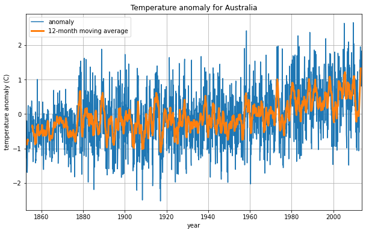

Simple documentation tutorial
=============================

Welcome to data_analysis!
=========================

Here is an example where *data_analysis* is used to calculate the moving average of surface-air temperature anomaly data of Australia.
 

Guide
^^^^^

.. toctree::
   :caption: Table of Contents
   :maxdepth: 2

   functions
   berkeley
   license
   help

Indices and tables
==================

* :ref:`genindex`
* :ref:`modindex`
* :ref:`search`
